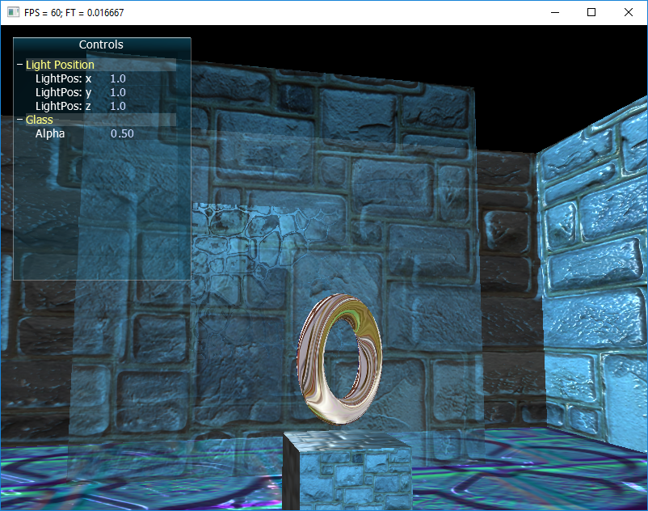
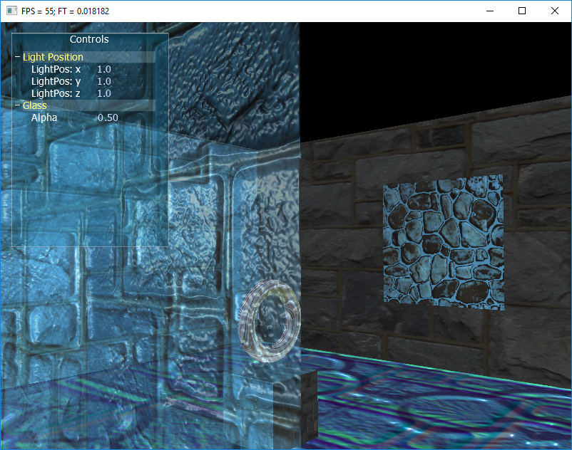

# OpenGL Assignment

This assignment was a final project for an OpenGL course.
The checkpoints:
    - A square room without a roof
    - One source of directional light with adjustable position
    - 2 frames as pictures on the wall
    - A mesh imported ring presented in the middle of the room
    - A transparent wall in the room with adjustable alpha value
    - A moveable camera, movable using W,A,S,D and a right click for camera rotation

# Screenshots

